## Project: Perception Pick & Place

---

# Required Steps for a Passing Submission:
1. Extract features and train an SVM model on new objects (see `pick_list_*.yaml` in `/pr2_robot/config/` for the list of models you'll be trying to identify). 
2. Write a ROS node and subscribe to `/pr2/world/points` topic. This topic contains noisy point cloud data that you must work with.
3. Use filtering and RANSAC plane fitting to isolate the objects of interest from the rest of the scene.
4. Apply Euclidean clustering to create separate clusters for individual items.
5. Perform object recognition on these objects and assign them labels (markers in RViz).
6. Calculate the centroid (average in x, y and z) of the set of points belonging to each object.
7. Create ROS messages containing the details of each object (name, pick_pose, etc.) and write these messages out to `.yaml` files, one for each of the 3 scenarios (`test1-3.world` in `/pr2_robot/worlds/`).  [See the example `output.yaml` for details on what the output should look like.](https://github.com/udacity/RoboND-Perception-Project/blob/master/pr2_robot/config/output.yaml)  
8. Submit a link to your GitHub repo for the project or the Python code for your perception pipeline and your output `.yaml` files (3 `.yaml` files, one for each test world).  You must have correctly identified 100% of objects from `pick_list_1.yaml` for `test1.world`, 80% of items from `pick_list_2.yaml` for `test2.world` and 75% of items from `pick_list_3.yaml` in `test3.world`.
9. Congratulations!  Your Done!

## [Rubric](https://review.udacity.com/#!/rubrics/1067/view) Points
### Here I will consider the rubric points individually and describe how I addressed each point in my implementation.  

---
### Writeup / README

#### 1. Provide a Writeup / README that includes all the rubric points and how you addressed each one.  You can submit your writeup as markdown or pdf.  

You're reading it!

| 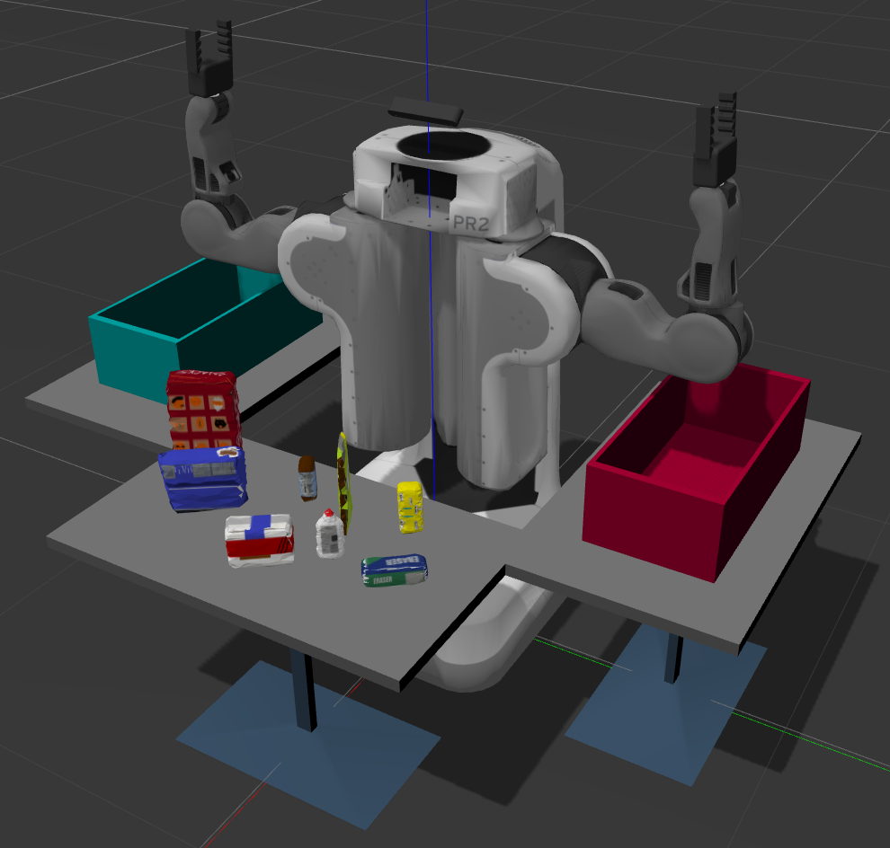                                                       |
|----------------------------------------------------------------------------------------|
| **Figure 1.  PR2 robot and the test 3 envronment in Gazebo for the Perception Pick & Place project.**|

**Figure 1** shows the PR2 robot and the environment it must perceive for the Perception Pick & Place project.  Each item on the table in front of the robot is identified, has its centroid calculated, and placement bin determined by the `pr2_robot/scripts/perception.py` script.  There are three different test worlds of increasing difficulty that are used in this project; however, results shown here focus on the more complex test 3 with eight objects to recognize.  This simulation can be launched by the following command:

```sh
$ roslaunch pr2_robot pick_place_project.launch
```

Then execute the following in a new terminal to run the `perception` node defined in `perception.py`:

```sh
$ cd run
$ rosrun pr2_robot perception.py
```

The `perception.py` script must be run from the `run` directory to use the trained support vector machine (SVM) model for object recognition.
Many of the settings used in creating and executing the perception pipeline can be found in `pr2_robot/scripts/inputs.py`.

### Exercise 1, 2 and 3 pipeline implemented
#### 1. Complete Exercise 1 steps. Pipeline for filtering and RANSAC plane fitting implemented.

The `perception` node subscribes to the `/pr2/world/points` topic, which provides noisy point cloud data from the simulated RGBD camera atop the robot, as shown in **Figure 2**. 

| 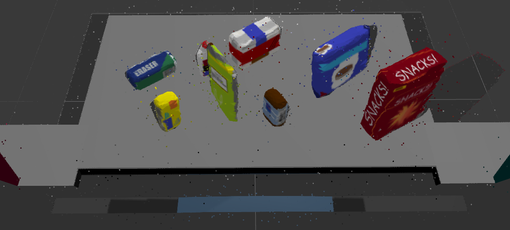                                                       |
|----------------------------------------------------------------------------------------|
| **Figure 2. Noisy piont cloud data from the RGBD camera atop the robot.**|

Therefore, the first step in the callback function of the `perception` subscriber, `pcl_callback()`, is to apply statistical outlier filtering to clean up the cloud.  Outlier filtering is performed with the following settings that can be found in the `inputs.py` module:

```python
# Statistical Outlier Filtering
#-----------------------------------------------------------------------------------------
K          = 5     # number of neighboring points to analyze
X          = 0.01  # threshold scale factor (outlier: distance > mean_distance+X*std_dev)
```

Resulting outlier filtering is shown in **Figure 3** from the robot's perspective, and a side view that more clearly shows the extensive removal of outliers is shown in **Figure 4**.

| 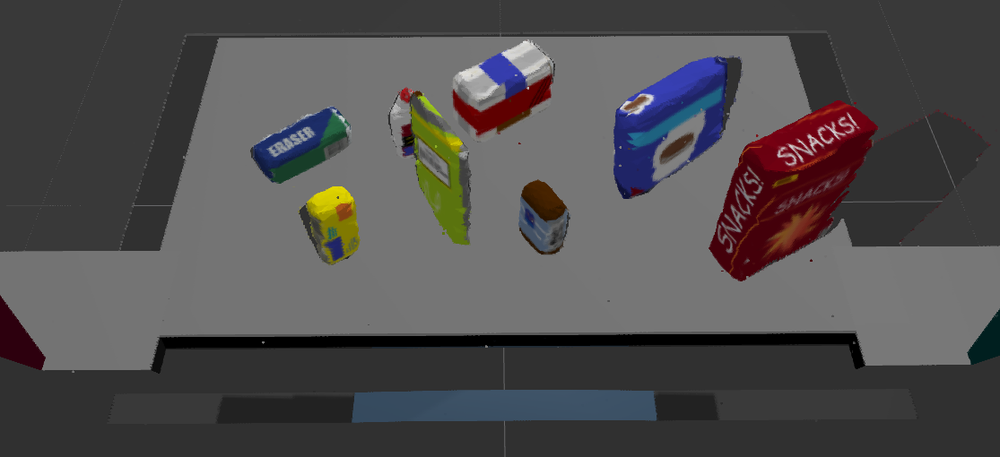                                                         |
|----------------------------------------------------------------------------------------|
| **Figure 3. Outlier filtering of the piont cloud from the robot's perspective.**|

| 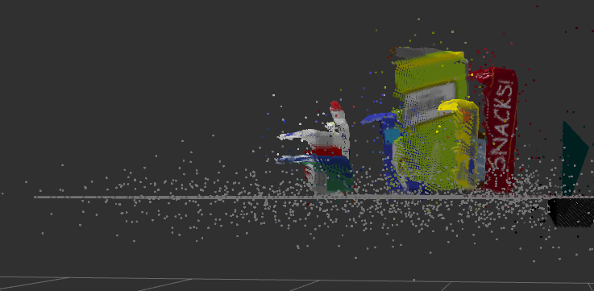                                                        |
|----------------------------------------------------------------------------------------|
| 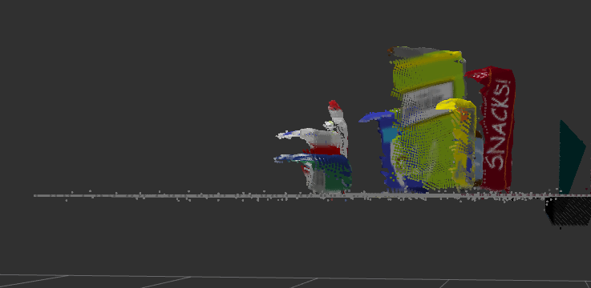                                             |
| **Figure 4. Side view of outlier filtering.**|

In order to reduce the amount of points that will undergo further processing, voxel grid downsampling is performed with the following leaf size setting:

```python
# Voxel Grid Downsampling
#-----------------------------------------------------------------------------------------
LEAF_SIZE  = 0.007 # voxel (or leaf) size in meters
```

Then a pass-through filter is used to remove the points below the table, above the objects, before the table, and after the table with the following limits:

```python
# PassThrough Filter
#-----------------------------------------------------------------------------------------
Z_AX_MIN   = 0.605 # below table top 
Z_AX_MAX   = 0.850 # above tallest object (snacks) 
X_AX_MIN   = 0.310 # before table
X_AX_MAX   = 0.868 # after table
```

Finally, RANSAC plane segmentation is performed with the following settings to separate the tabletop from the objects:

```python
# RANSAC Plane Segmentation
#-----------------------------------------------------------------------------------------
MAX_DIST   = 0.01  # max distance for a point to be considered fitting the model
```

The resulting tabletop is shown in **Figure 5**, and the objects are shown in **Figure 6**.

| 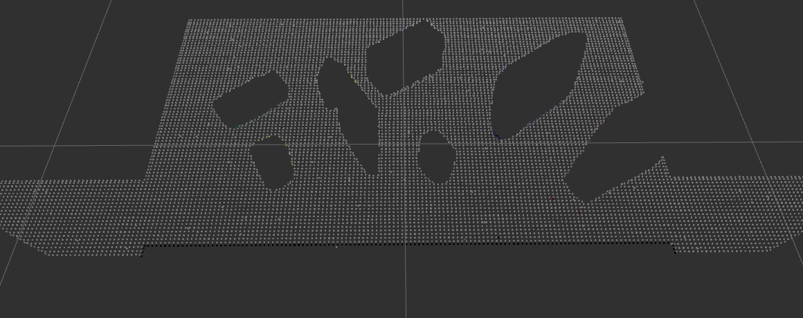                                                              |
|----------------------------------------------------------------------------------------|
| **Figure 5.  Tabletop extracted by RANSAC plane segmentation.**|

| 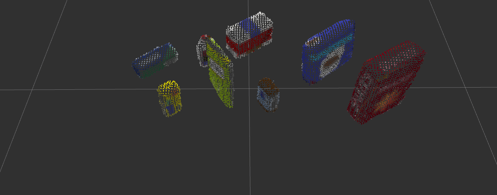                                                            |
|----------------------------------------------------------------------------------------|
| **Figure 6.  Objects remaining after removing the tabletop by RANSAC plane segmentation.**|

#### 2. Complete Exercise 2 steps: Pipeline including clustering for segmentation implemented.  

Now that the objects have been separated from the rest of the point cloud, Euclidean clustering is used to segment the objects into individual point clouds with the following settings:

```python
# Euclidean Clustering
#-----------------------------------------------------------------------------------------
# Distance threshold is set to voxel diagonal.
# Cluster size thresholds lead with an object surface area term.
CLUSTER_TOL      = sqrt(3) * LEAF_SIZE     # distance threshold
CLUSTER_SIZE_MIN = 0.004   * LEAF_SIZE**-2 # minimum number of cluster points
CLUSTER_SIZE_MAX = 0.100   * LEAF_SIZE**-2 # maximum number of cluster points
```

Notice that clustering settings are a function of `LEAF_SIZE` so they will scale with changes to the downsample resolution.  Resulting object clusters are colored individually in **Figure 7**.

| 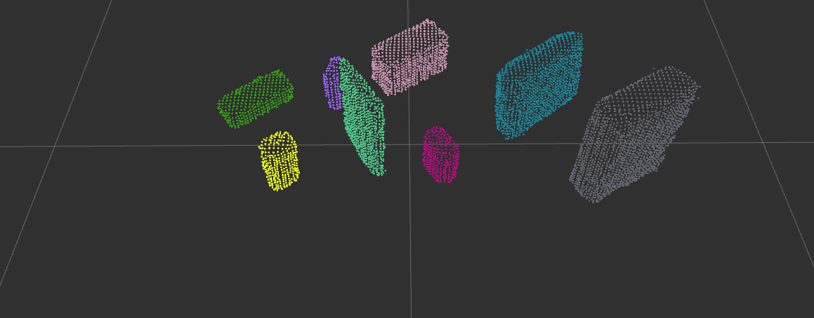                                                            |
|----------------------------------------------------------------------------------------|
| **Figure 7.  Object clusters after Euclidean clustering.**|

#### 2. Complete Exercise 3 Steps.  Features extracted and SVM trained.  Object recognition implemented.

Features for the SVM are histograms of HSV color values with a range of 0 to 256, and histograms of surface normals with a range of -1.0 to 1.0.  The functions that return these histograms given point cloud data are `compute_color_histograms()` and `compute_normal_histograms()` in the `pr2_robot/scripts/perception_training/features.py` module.  Feature extraction is done by executing the following commands:
1. Launch the simulation environment.
```sh
$ roslaunch sensor_stick training.launch
```
2. In a new terminal, run the `capture_features.py` script.
```sh
$ cd run
$ rosrun pr2_robot capture_features.py
```
Note that [sensor_stick](https://github.com/udacity/RoboND-Perception-Exercises/tree/master/Exercise-3/sensor_stick) from Exercise 3 of the [RoboND-Perception-Exercises](https://github.com/udacity/RoboND-Perception-Exercises) repository is required in `$CATKIN_WS/src`.

Settings used in  `pr2_robot/scripts/capture_features.py` are as follows:

```python
# Training Set
#-----------------------------------------------------------------------------------------
N_CAPTURES = 200   # number of captures per model
N_BINS     = 64    # number of histogram bins per feature component
WORLD      = 3     # which world models to capture  
```

Acquiring 200 captures of each object model can take about 1 hour, but provides enough data to train the SVM well.  After `capture_features.py` completes, the training data is saved to `training_set.sav` in the `run` directory.  SVM classification training can then be completed by running the `pr2_robot/scripts/train_svm.py` script:

```sh
$ cd run
$ rosrun pr2_robot train_svm.py
```

Different kernels and parameters were explored for the [`sklearn.svm.SVC`](http://scikit-learn.org/stable/modules/generated/sklearn.svm.SVC.html#sklearn.svm.SVC) classifier, including the `rbf` kernel which readily exhibited over-fitting issues; however, the [`sklearn.svm.LinearSVC`](http://scikit-learn.org/stable/modules/generated/sklearn.svm.SVC.html#sklearn.svm.SVC) classifier was found to give the best performance.  Note that using `LinearSVC` is not the same as using the `linear` kernel in `SVC`.  `LinearSVC` is implemented in terms of the `liblinear` library which has more flexibility in the choice of penalties and loss functions, and `SVC` is implemented in terms of `libsvm`.  Creating the classifier with the following options as shown in `training_svm.py`:

```python
# Create classifier
clf = svm.LinearSVC(penalty='l1', loss='squared_hinge', dual=False, C=0.1)
```

outputs a trained SVM (`model.sav` in the `run` directory) with the following accuracy from 5-fold cross-validation:

```
Accuracy: 0.98 (+/- 0.01) 
```

The resulting confusion matrix in **Figure 8** shows good classification ability for each of the eight objects from test 3.

| 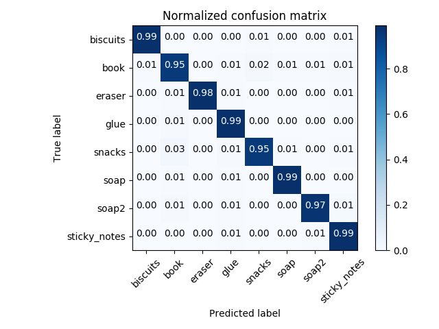                                              |
|----------------------------------------------------------------------------------------|
| **Figure 8.  Normalized Confusion Matrix from `LinearSVC` for the objects of test 3.**|

Applying the classifier within `perception.py` correctly predicts all eight objects in test 3, even that pesky glue hiding behind the book!  Correctly labeled objects are shown in the RViz window of **Figure 9**.  

| 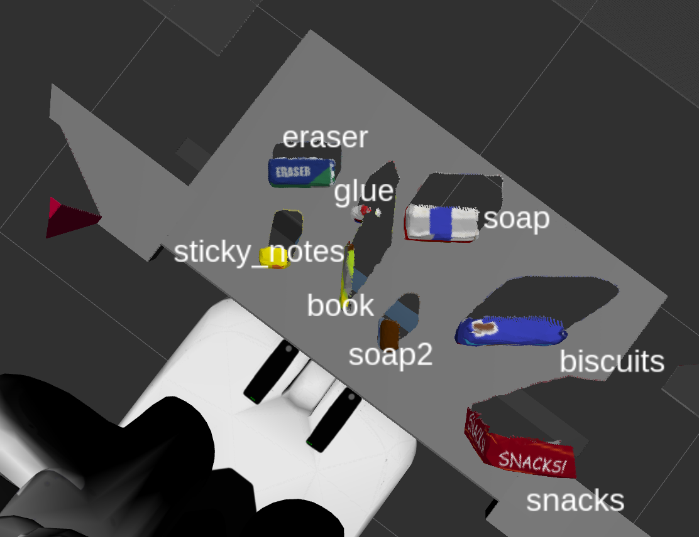                                           |
|----------------------------------------------------------------------------------------|
| **Figure 9.  Objects labeled 100% correctly in test 3 using the trained `LinearSVC` classifier.**|

The same trained SVM classifier that is used to label the objects for test 3 in **Figure 9** is used on test 1 and 2 with 100% success as well.

### Pick and Place Setup

#### 1. For all three tabletop setups (`test*.world`), perform object recognition, then read in respective pick list (`pick_list_*.yaml`). Next construct the messages that would comprise a valid `PickPlace` request, and output them to `.yaml` format.

[//]: # (Spend some time at the end to discuss your code, what techniques you used, what worked and why, where the implementation might fail and how you might improve it if you were going to pursue this project further.)

The remaining step is to read in the pick list, construct `PickPlace` request messages for each detected object in the list, and output the request parameters to a `.yaml` file.  This step is implemented in the `pr2_mover()` function of `perception.py`.  The `arm_name` and `object_name` can be extracted from the `object_list` (pick list) on the ROS parameter server, `pick_pose` is calculated as the centroid of each object's point cloud, `place_pose` of the boxes can be loaded from the `dropbox` parameter, and `test_scene_num` is set up to be directly loaded from the parameter server.  The following is an example of these request parameters in `yaml` format for the `sticky_notes`:

```yaml
object_list:
- arm_name: left
  object_name: sticky_notes
  pick_pose:
    orientation:
      w: 0.0
      x: 0.0
      y: 0.0
      z: 0.0
    position:
      x: 0.4396542012691498
      y: 0.2160012125968933
      z: 0.6842081546783447
  place_pose:
    orientation:
      w: 0.0
      x: 0.0
      y: 0.0
      z: 0.0
    position:
      x: 0
      y: 0.71
      z: 0.605
  test_scene_num: 3
```

`output_*.yaml` files generated by `perception.py` for test 1, 2, and 3 can be found in the `output` directory.

This project implementation is able to correctly identify 100% of the objects from each of the three test worlds.  Taking the project further would include reworking the implementation to handle the `tabletop_challenge.world` shown in **Figure 10**.

| 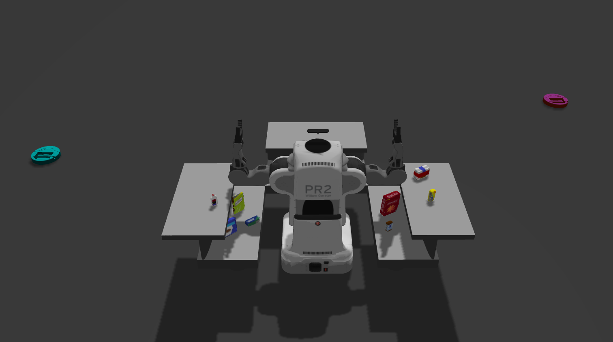                                           |
|----------------------------------------------------------------------------------------|
| **Figure 10.  Tabletop challenge world.**|

At a minimum, changes to the pass-through filtering would have to be made since the current settings keep only the table in front of the robot.
